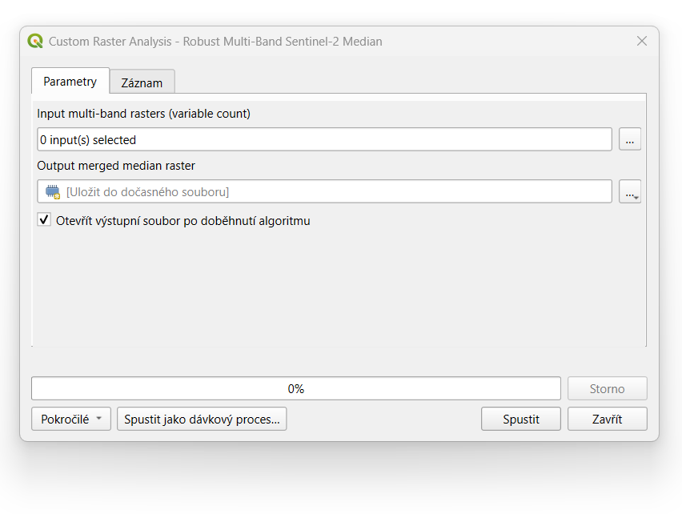

# Robust Multi-Band Sentinel-2 Median (QGIS Processing Script)

A custom QGIS Processing tool designed to calculate the pixel-by-pixel temporal **median** across a collection of multi-band Sentinel-2 raster scenes. It natively supports variable image counts, processes all spectral bands automatically in a single execution loop, and provides an integrated GUI window within the native QGIS interface.

---

## Key Features

* **True Multi-Band Processing:** Avoids separating and re-merging individual bands. Iterates over all spectral channels sequentially, preserving the internal band structure of the source imagery.
* **Dynamic Grid Intersection (Robust Mode):** Automatically calculates the minimum common spatial dimensions ($cols \times rows$) across all selected inputs. This prevents runtime errors (`Access window out of range`) caused by minor 1-to-2 pixel owerflow variations often found in Sentinel-2 AOI extractions.
* **Cloud & NoData Handling:** Automatically checks for the native dataset `NoData` mask value, converts masked pixels to `NaN`, and uses `numpy.nanmedian()` to ensure clean data integration without including background or obscured values in the statistical stack.

---

## Technical Specifications

| Parameter | Specification |
| :--- | :--- |
| **Language & Environment** | Python 3.x / QGIS 4+ API / OSGeo GDAL |
| **Core Libraries** | `numpy`, `osgeo.gdal` |
| **Input Data Requirements** | Same Coordinate Reference System (CRS), identical pixel alignment, matching band count |
| **Data Types Supported** | `GDAL GDT_Float32` output (matches standard reflectance scalability) |

---

## Installation

1. Open **QGIS**.
2. Open the **Processing Toolbox** panel (`Ctrl + Alt + T`).
3. Click the **Python icon with a gear** at the top of the panel and select **Create New Python Script...**.
4. Paste the complete script code into the editor.
5. In the script editor toolbar, click **Save As** (floppy disk with pen icon) and save the file to the default QGIS directory as `robust_multiband_median_en.py`.
6. Click the green **Run Script** arrow button to register the tool within QGIS.

The tool will now permanently appear at the bottom of your Processing Toolbox under:  
`Scripts` ➔ `Custom Raster Analysis` ➔ `Robust Multi-Band Sentinel-2 Median`

---

## How to Use

### 1. Open the Tool
Double-click **Robust Multi-Band Sentinel-2 Median** inside your Processing Toolbox panel.

### 2. Parameter Configurations

* **Input multi-band rasters (variable count):** Click the browse button `...`, check all the multi-band `.tif` files representing your time series/clips, and click **OK**.
* **Output merged median raster:** Define the destination path and name for the resulting multi-band GeoTIFF file. If left blank, QGIS will output a temporary memory layer.

### 3. Execution
Click **Run**. The log tab will track processing progress per band channel (`0%` to `100%`). Once finished, the tool will automatically load the multi-band median file into your QGIS Layers panel.

---

## Limitations & Verification Caveats

> [!WARNING]
> **Spatial Shift / Grid Realignment Check** > While this script handles slightly differing image sizes safely by cropping at the bottom-right array boundaries, it assumes that the top-left coordinate $(X_{min}, Y_{max})$ matches exactly across all scenes. If input rasters have actual geographic offsets, pixel matrices will misalign, leading to combined stats across distinct ground targets. Ensure your input clips originate from matching original granules/tiles or use a fixed bounding box template during pre-processing extractions.